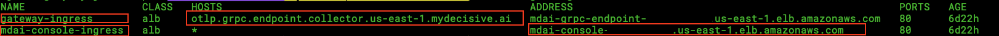
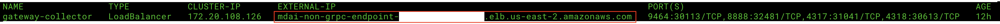
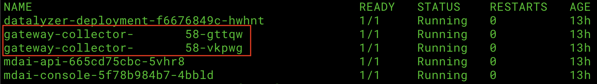
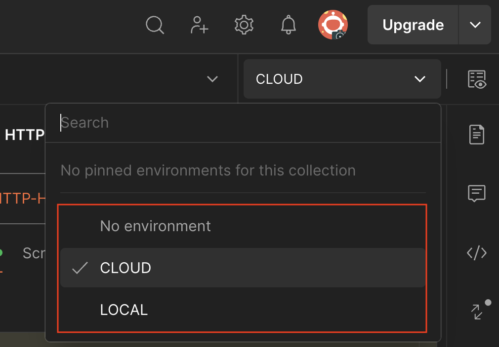
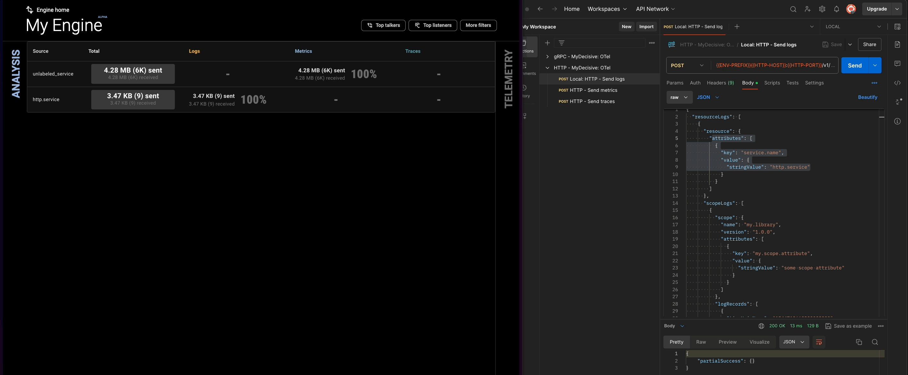

# MDAI Postman Collections

⚠️ Note: These docs assume you have already [installed an MDAI Cluster](https://docs.mydecisive.ai/install/installation.html)! ⚠️

## Choose how you want to use Postman

1. Browser - https://go.postman.co/homenull
2. App - https://www.postman.com/downloads/

## How to import an HTTP Postman collection

Follow the [Postman guide](https://learning.postman.com/docs/getting-started/importing-and-exporting/importing-data/) fo importing our HTTP endpoints collection to start testing your MDAI Cluster today.

The postman collection for HTTP requests can be found at the root of this directory.
`HTTP - MyDecisive- OTel.postman_collection.json`

## Using environments

We recommend that you setup two different environments:
1. `MDAI: Local`
2. `MDAI: Cloud`

We use very light-weight environment variables for testing our MDAI Clusters.

[Read more](https://learning.postman.com/docs/sending-requests/variables/environment-variables/) on how to incorporate environment variables to test your MDAI Cluster in its respective environment.


Our collection uses the following `env` variables

| Environment | ENV_PREFIX | GRPC_HOST                                      | HTTP_HOST                                          | GRPC_PORT | HTTP_PORT |
|-------------| -----------|------------------------------------------------|----------------------------------------------------|-----------|-----------|
| **Cloud**   | `https://` | mdai-grpc-s0m34@54.us-east-1.elb.amazonaws.com | mdai-non-grpc-s0m34@54.elb.us-east-1.amazonaws.com | 443       | 4318      |
| **Local**   | `http://`  | localhost                                      | localhost                                          | 4317      | 4317      |


Not sure where to get the variables for `GRPC_HOST` and `HTTP_HOST`?
* I need my Cloud env. variables [Get them now!](./README.md#cloud)
* I need my Local env. variables [Get them now!](./README.md#cloud)


## How to get these env. variables


### Cloud

#### GRPC_HOST & GRPC PORT

You can find your `GRPC_HOST` value by running: 

```shell
kubectl get ingress -n default
```

Your output should look something like this...

<a href="ingress-output.png" target="_blank">
  
</a>

For `gateway_ingress`, note the `HOSTS` value. This will be used for your `GRPC_HOST`

Your `GRPC_PORT` will always be `:443`, as this is the secure listener for your gRPC endpoint.

*You can also make note of the `mdai-console-ingress`, `ADDRESS` value to validate requests sent from postman later.*

#### HTTP_HOST & HTTP_PORT

You can find your `HTTP_HOST` value by running: 

```shell
kubectl get svc gateway-collector -n default
```

Your output should look something like this...

<a href="service-output.png" target="_blank">
  
</a>


For the `gateway_collector` service, note the `EXTERNAL-IP` value. This will be used for your `HTTP_HOST`

Your `HTTP_PORT` will always be `:4318`, as this is the secure listener for your gRPC endpoint.


### Local


For Local testing your `GRPC_HOST` and `HTTP_HOST` will always be `localhost`.


#### Port-forward your ingress endpoints

The ports, however, will need to be forwarded to their respective testing ports. Luckily there are two pods created during cluster install. You should be able to forward each of them to retrieve requests, one for `http` and another to `gRPC` requets.

```shell
kubectl get pod
```

Your output should look like...

<a href="pods-output.png" target="_blank">
  
</a>

Make note of your `gateway-collector` pod names. For simplicity we will use the ports: 
* `4713` for gRPC requests 
* `4813` for http requests

**Now let's forward those ports!**

```shell
# Example port-forward request
kubectl port-forward <POD_NAME> <PORT>:<PORT>

# gRPC Example 

kubectl port-forward gateway-collector-abcd123-xyz1 4318:4318

# HTTP Example

kubectl port-forward gateway-collector-abcd123-1zyx 4317:4317
```

## Start firing off requests

Local and cloud should be the same across the requests. You should only have to adjust the environment when moving between local and cloud testing.

<a href="switch-env.png" target="_blank">
  
</a>

### Sending HTTP Requests: Local & Cloud

Fire off any of the requests! The following is a logs request. You can also see the Console UI updates after the requests is sent validating the request is successful end-to-end.

<a href="send-logs.gif" target="_blank">
  
</a>

### 🚧 Sending gRPC Requests: Local & Cloud 🚧
We hit a few snags along the way during testing. Check back soon! We're on it!


## Feedback 

Are you experiencing issues or would like to submit a request to our team?
* Email us at <a href="mailto:support@mydecisive.ai" target="_blank">support@mydecisive.ai</a>
* File an issue under the <a href="https://github.com/DecisiveAI/postman/issues/new" target="_blank">MDAI Postman</a>